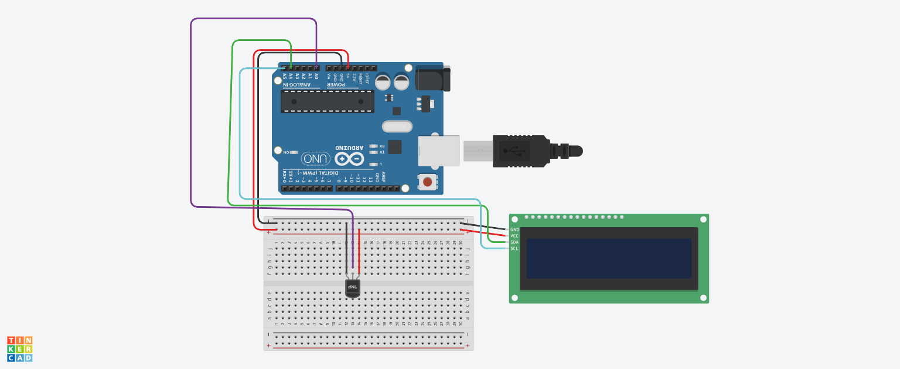

 # Projeto de sensor de temperatura

este projeto foi desenvolvido dentro do trinkercard, na disciplina de internet das coisas 
(IOT), para a criação de um prototipo com arduino que simule um sensor de temperatura, como se fosse um termometro.

## Componentes Usados
1 - 1 Arduino Uno
2 - 1 Sensor de temperatura
3 - 9 Jumpers Macho-Macho
4 - 1 Tela LCD 16x2
5 - 1 Placa de ensaio

## Montagem do Circuito

## Explicação do código

// BIBLIOTECA LCD COM MODULO I2C
#include <LiquidCrystal_I2C.h>

// INICIALIZAR LCD
LiquidCrystal_I2C telaLcd(0x20,16,2);

//variavel do sensor de temperatura
int sensorTMP = A0;

//capturar temperatura
int valorlido =0;

void setup(){
 //definir o sensor como entrada
  pinMode(sensorTMP,INPUT);
 //ligar a tela lcd
  telaLcd.init();
 //limpar os dados que aparecem
  telaLcd.clear();
 
}

void loop()
{
 //capturar o valor da temperatura
  valorlido = analogRead(sensorTMP);
//converter valor da tensão
  float tensao = (valorlido*5.0)/1023;
//converter a tensão em graus celsius
  float temperatura = (tensao-0.5) * 100;
  telaLcd.backlight();
  
//imprimir valor da temperatura no LCD
  telaLcd.setCursor(0,0);
  telaLcd.print(temperatura);
}
