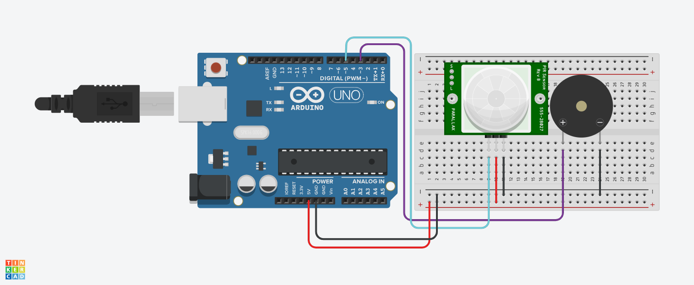

 # Projeto de sensor de movimento.

este projeto foi desenvolvido dentro do trinkercard, na disciplina de internet das coisas 
(IOT), para a criação de um prototipo com arduino que emite um alarme quando chegado uma
certa distancia do dispositivo.

## Componentes Usados
1 - 1 Arduino Uno
2 - 1 Sensor de distância
3 - 8 Jumpers Macho-Macho
4 - 1 Placa de ensaio
5 - 1 sensor PIR
6 - 1 PieZO
7 - 1 Leds
8 - 1 Resistor

## Montagem do Circuito

## Explicação do código

// C++ code
//
int sensorPIR =3;
int buzzer =5;
void setup()
{
  pinMode(sensorPIR, INPUT);
  pinMode(buzzer,OUTPUT);
}

void loop()
{
 int detectarPresencao= digitalRead(sensorPIR);
  if(detectarPresencao == 1){
    tone(buzzer,264);
  }else{
   noTone(buzzer);
  }
  
}

