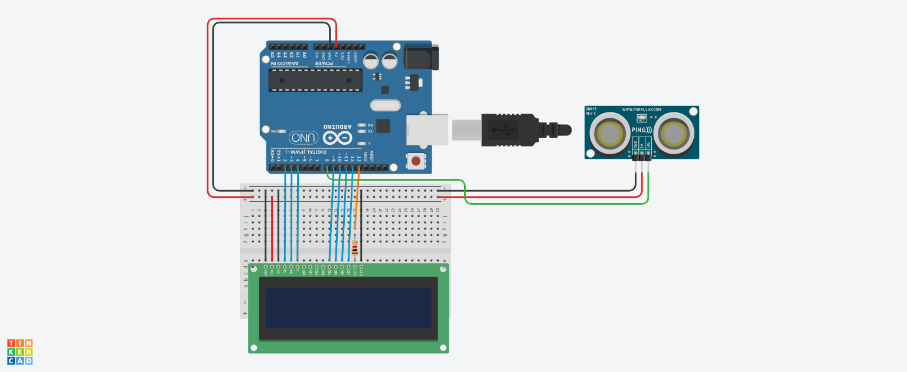

 # Projeto de tela LCD sensor de distância

este projeto foi desenvolvido dentro do trinkercard, na disciplina de internet das coisas 
(IOT), para a criação de um prototipo com arduino que simule uma mensagem de mantenha
distânci toda vez que alguém se aproxime a menos de 1 metro de sensor.

## Componentes Usados
1 - 1 Arduino Uno
2 - 1 Sensor de distância
3 - 14 Jumpers Macho-Macho
4 - 3 Jumpers Macho-Fêmea
5 - 1 Tela LCD 16x2
6 - 1 Placa de ensaio
7 - 1 Resistor de 1 KOhms

## Montagem do Circuito

## Explicação do código

Importando a blibioteca LCD>
#include <LiquidCrystal.h>

criar a variavel do LCD
LiquidCrystal lcd(2,3,4,9,10,11,12);

int ledLcd =13;

metodo para capturar a distancia
retorna numero quebrado longo
long distancia(int trigger,int echo){
  trigger porta de saida
pinMode(trigger,OUTPUT);
digitalWrite(trigger,LOW); 
delay(5); -espere 5 milisegundos  
echo porta de entrada
digitalWrite(trigger,HIGH); 
delay(10); espere 10 milisegundos
digitalWrite(trigger,LOW);  desliga porta
echo porta de entrada
 pinMode(echo,INPUT); definir porta de entrada
  
 return pulseIn(echo,HIGH);

  
}
void setup()
{
  
  pinMode(ledLcd,OUTPUT); definir ledlcd saida
  digitalWrite(ledLcd, HIGH); ligar os LEDs do LCD
  lcd.begin(16,2); informar que o led tem 16 colunas e 2 linhas
  lcd.clear(); // iniciar o lcd limpo
 
}

Metodo para executar infinitamente o código de conversão da distância para cm, e
impressão das mensagens de "Mantenha Distâmcia".
 
void loop()
{
  transformar o valor recebido paracm
  int cm = 0.01723 * distancia(8, 8);
  
  if(cm<100){ se menor que 1 metro/100cm
  
  
  
 lcd.setCursor(0,0); iniciar a escrita na linha 0 coluna 0
 lcd.print("MANTENHA");
 lcd.setCursor(0,1); iniciar a escrita na linha 0 coluna 0
 lcd.print("DISTANCIA");
  }else{ senão
    lcd.clear(); apague todas as mensagens do display
    
  }
}

